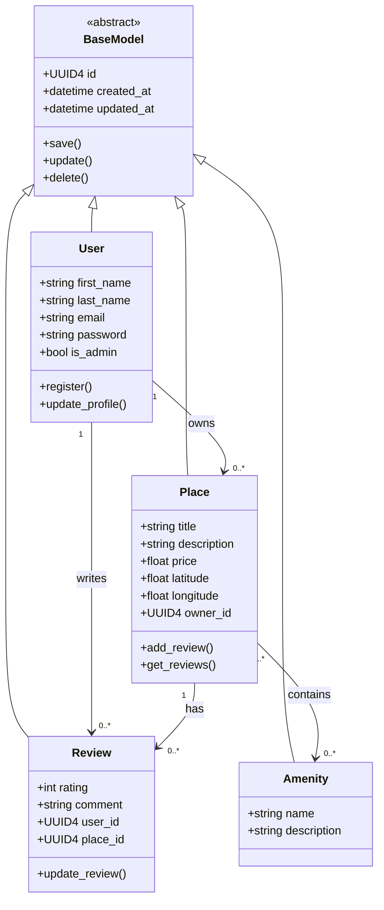

```mermaid
classDiagram

class BaseModel {
    <<abstract>>
    +UUID4 id
    +datetime created_at
    +datetime updated_at
    +save()
    +update()
    +delete()
}

class User {
    +string first_name
    +string last_name
    +string email
    +string password
    +bool is_admin
    +register()
    +update_profile()
}

class Place {
    +string title
    +string description
    +float price
    +float latitude
    +float longitude
    +UUID4 owner_id
    +add_review()
    +get_reviews()
}

class Review {
    +int rating
    +string comment
    +UUID4 user_id
    +UUID4 place_id
    +update_review()
}

class Amenity {
    +string name
    +string description
}

BaseModel <|-- User
BaseModel <|-- Place
BaseModel <|-- Review
BaseModel <|-- Amenity

User "1" --> "0..*" Place : owns
User "1" --> "0..*" Review : writes
Place "1" --> "0..*" Review : has
Place "0..*" --> "0..*" Amenity : contains
```
