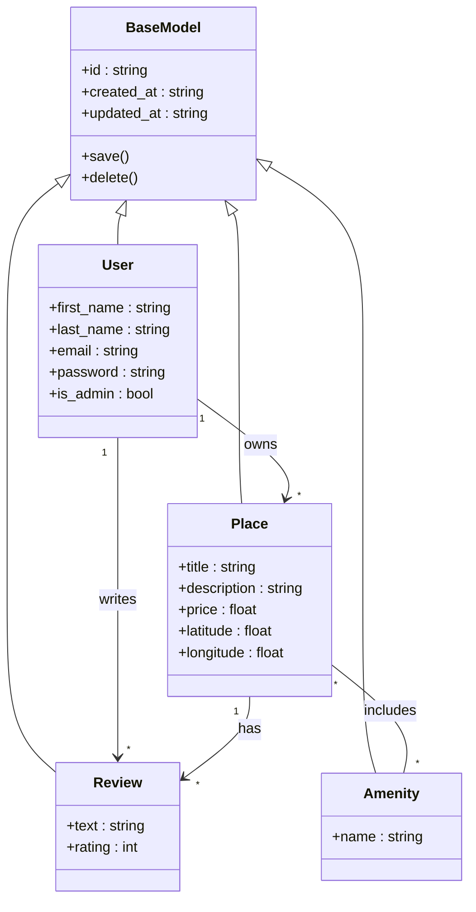

# delet fcjcfn

```mermaid
classDiagram

class BaseModel {
  +id : string
  +created_at : string
  +updated_at : string
  +save()
  +delete()
}

class User {
  +first_name : string
  +last_name : string
  +email : string
  +password : string
  +is_admin : bool
}

class Place {
  +title : string
  +description : string
  +price : float
  +latitude : float
  +longitude : float
}

class Review {
  +text : string
  +rating : int
}

class Amenity {
  +name : string
}

BaseModel <|-- User
BaseModel <|-- Place
BaseModel <|-- Review
BaseModel <|-- Amenity

User "1" --> "*" Place : owns
User "1" --> "*" Review : writes
Place "1" --> "*" Review : has
Place "*" -- "*" Amenity : includes
```
